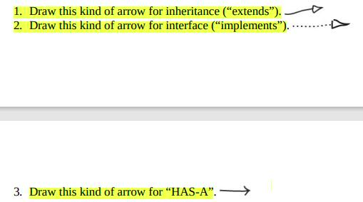
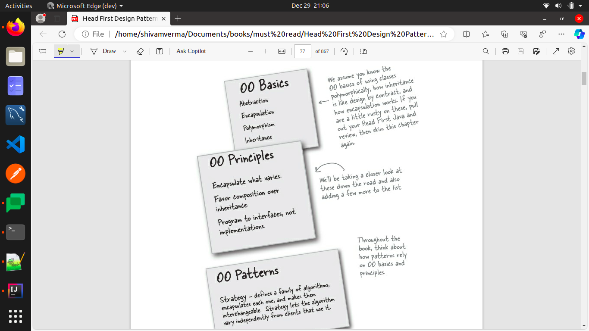
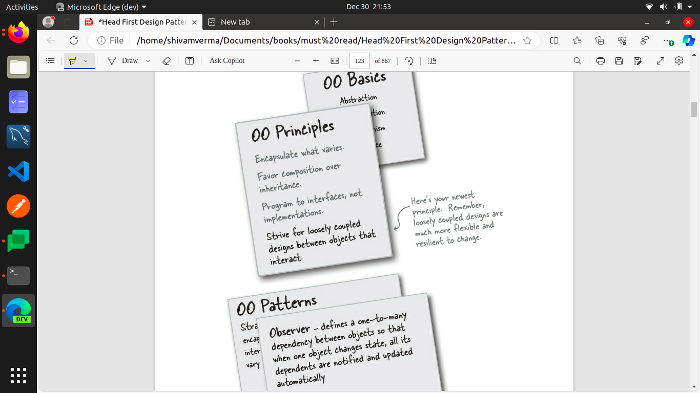

## Summary
- 
- 
- Bullet Points:
  - Knowing the OO basics does not make you a good OO designer.
  - Good OO designs are reusable, extensible, and maintainable.
  - Patterns show you how to build systems with good OO design qualities.
  - Patterns are proven object-oriented experience.
  - Patterns don’t give you code, they give you general solutions to design problems.
  - You apply them to your specific application
  - Patterns aren’t invented, they are discovered.
  - Most patterns and principles address issues of change in software.
  - Most patterns allow some part of a system to vary independently of all other parts.
  - We often try to take what varies in a system and encapsulate it.
  - Patterns provide a shared language that can maximize the value of your communication with other developers.
- Observer Pattern
  - 
  - Bullet Points: 
    - The Observer Pattern defines a one-to-many relationship between objects.
    - Subjects, or as we also know them, Observables, update Observers using a common
      interface.
    - Observers are loosely coupled in that the Observable knows nothing about them,
      other than that they implement the Observer interface.
    - You can push or pull data from the Observable when using the pattern (pull is
      considered more “correct”).
    - Don’t depend on a specific order of notification for your Observers.
    - Java has several implementations of the Observer Pattern, including the general
      purpose java.util.Observable.
    - Watch out for issues with the java.util.Observable implementation.
    - Don’t be afraid to create your own Observable implementation if needed.
    - Swing makes heavy use of the Observer Pattern, as do many GUI frameworks.
    - You’ll also find the pattern in many other places, including JavaBeans and RMI.

- Decorator Pattern:
  - The Decorator Pattern attaches additional responsibilities to an object dynamically. Decorators provide a flexible alternative to subclassing for extending functionality.
  - Bullet points: 
    - Inheritance is one form of extension, but not necessarily the best way to achieve
      flexibility in our designs.
    - In our designs we should allow behavior to be extended without the need to modify
      existing code.
    - Composition and delegation can often be used to add new behaviors at runtime.
    - The Decorator Pattern provides an alternative to subclassing for extending behavior.
    - The Decorator Pattern involves a set of decorator classes that are used to wrap
      concrete components.
    - Decorator classes mirror the type of the components they decorate. (In fact, they are
      the same type as the components they decorate, either through inheritance or
      interface implementation.)
    - Decorators change the behavior of their components by adding new functionality
      before and/or after (or even in place of) method calls to the component.
    - You can wrap a component with any number of decorators.
    - Decorators are typically transparent to the client of the component; that is, unless the
      client is relying on the component’s concrete type.
    - Decorators can result in many small objects in our design, and overuse can be
      complex.

