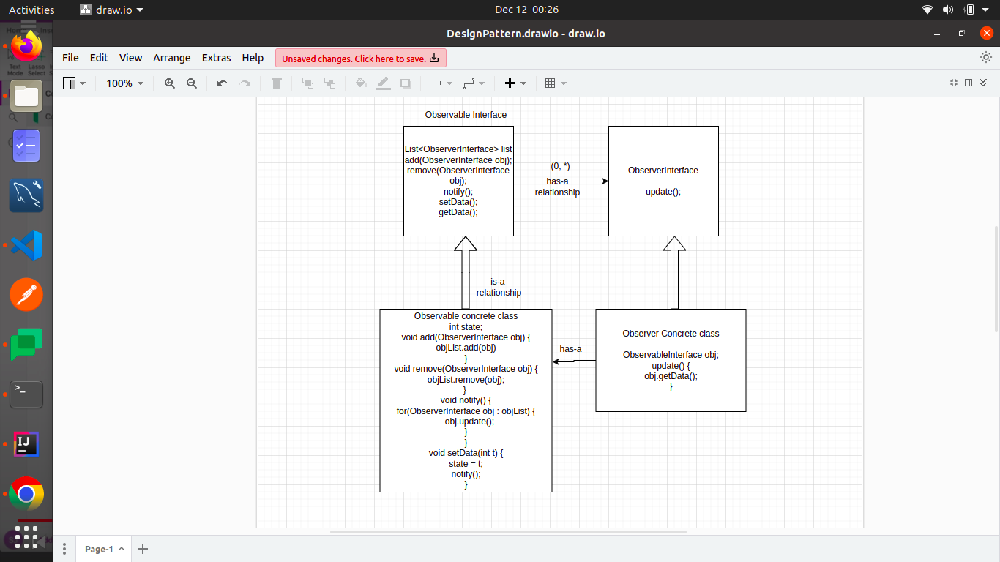

# Design Patterns
- very important topic for LLD
- Design patterns are the principles for OOP, using design pattern we design manageable, scalable software design, which helps us when we scale.

## What's a design pattern?
- Design patterns are typical solutions to commonly occurring problems in software design. They are like pre-made blueprints that you can customize to solve a recurring design problem in your code.
- You can’t just find a pattern and copy it into your program, the way you can with off-the-shelf functions or libraries. The pattern is not a specific piece of code, but a general concept for solving a particular problem. You can follow the pattern details and implement a solution that suits the realities of your own program.
- Patterns are often confused with algorithms, because both concepts describe typical solutions to some known problems. While an algorithm always defines a clear set of actions that can achieve some goal, a pattern is a more high-level description of a solution. The code of the same pattern applied to two different programs may be different.
- An analogy to an algorithm is a cooking recipe: both have clear steps to achieve a goal. On the other hand, a pattern is more like a blueprint: you can see what the result and its features are, but the exact order of implementation is up to you.

## What does the pattern consist of?
-  Intent of the pattern briefly describes both the problem and the solution.
-  Motivation further explains the problem and the solution the pattern makes possible.
-  Structure of classes shows each part of the pattern and how they are related.
-  Code example in one of the popular programming languages makes it easier to grasp the idea behind the pattern.

### Strategy Design Pattern
#### When to use strategy pattern ?
- when we found that in a parent child relation-ship in inheritance, the child classes are having a same piece of code (duplicate code) which is not present into the base class.
    - Using strategy pattern we can avoid this code duplicacy. Also, as the number of features grows it's not good to have duplicate code.

                               (0) -> base class 
                             /  |  \ 
                            /   |   \
                          (1)  (2)  (3) -> child classes(1, 3) having same code
    - this can be solved by strategy pattern.
    - In the implementation without strategy pattern we can see that OffRoadVehicle and SportsVehicle have the same functionality, i.e. code duplicacy.
    - With strategy pattern implementation the issue is fixed.
---

### Observer Design pattern
- In this design pattern we have observer and observable.
- 
- 