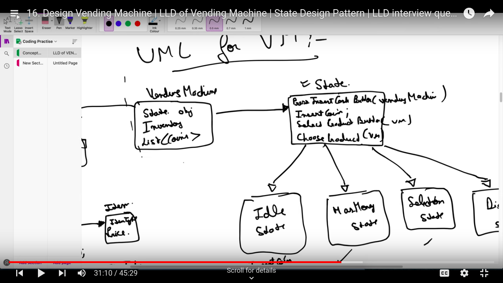
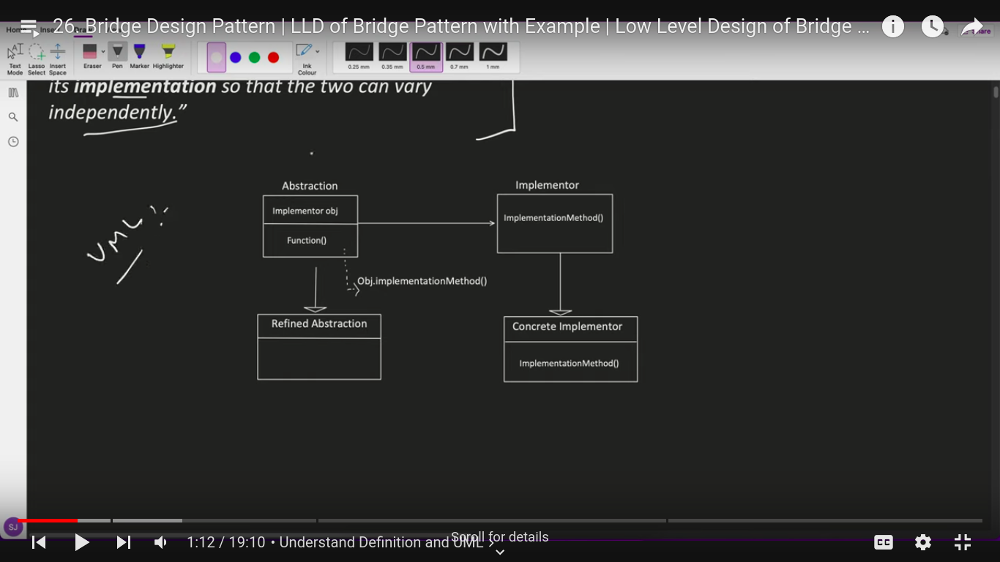

# Design Patterns
- very important topic for LLD
- Design patterns are the principles for OOP, using design pattern we design manageable, scalable software design, which helps us when we scale.

### `Note: Inheritance is an "is-a" relationship. Composition is a "has-a"`.
- You do composition by having an instance of another class C as a field of your class, instead of extending C. A good example where composition would've been a lot better than inheritance is java.util.Stack, which currently extends java.util.Vector. This is now considered a blunder. A stack "is-NOT-a" vector; you should not be allowed to insert and remove elements arbitrarily. It should've been composition instead.
- Unfortunately it's too late to rectify this design mistake, since changing the inheritance hierarchy now would break compatibility with existing code. Had Stack used composition instead of inheritance, it can always be modified to use another data structure without violating the API.
- composition: which is delegating work to other objects.

## What's a design pattern?
- Design patterns are typical solutions to commonly occurring problems in software design. They are like pre-made blueprints that you can customize to solve a recurring design problem in your code.
- You can’t just find a pattern and copy it into your program, the way you can with off-the-shelf functions or libraries. The pattern is not a specific piece of code, but a general concept for solving a particular problem. You can follow the pattern details and implement a solution that suits the realities of your own program.
- Patterns are often confused with algorithms, because both concepts describe typical solutions to some known problems. While an algorithm always defines a clear set of actions that can achieve some goal, a pattern is a more high-level description of a solution. The code of the same pattern applied to two different programs may be different.
- An analogy to an algorithm is a cooking recipe: both have clear steps to achieve a goal. On the other hand, a pattern is more like a blueprint: you can see what the result and its features are, but the exact order of implementation is up to you.

## What does the pattern consist of?
-  Intent of the pattern briefly describes both the problem and the solution.
-  Motivation further explains the problem and the solution the pattern makes possible.
-  Structure of classes shows each part of the pattern and how they are related.
-  Code example in one of the popular programming languages makes it easier to grasp the idea behind the pattern.

## Why should I learn patterns?
- The truth is that you might manage to work as a programmer for many years without knowing about a single pattern. A lot of people do just that. Even in that case, though, you might be implementing some patterns without even knowing it. So why would you spend time learning them?
- Design patterns are a toolkit of tried and tested solutions to common problems in software design. Even if you never encounter these problems, knowing patterns is still useful because it teaches you how to solve all sorts of problems using principles of object-oriented design.
- Design patterns define a common language that you and your teammates can use to communicate more efficiently. You can say, “Oh, just use a Singleton for that,” and everyone will understand the idea behind your suggestion. No need to explain what a singleton is if you know the pattern and its name.

## Criticism of patterns
- Unjustified use: If all you have is a hammer, everything looks like a nail.
- This is the problem that haunts many novices who have just familiarized themselves with patterns. Having learned about patterns, they try to apply them everywhere, even in situations where simpler code would do just fine.

## Classification of patterns
- All patterns can be categorized by their intent, or purpose.
- `Creational patterns` provide object creation mechanisms that increase flexibility and reuse of existing code.
- `Structural patterns` explain how to assemble objects and classes into larger structures, while keeping these structures flexible and efficient.
- `Behavioral patterns` take care of effective communication and the assignment of responsibilities between objects.

## Catalog of Patterns
- Creational patterns:
  - Prototype
  - Singleton
  - Builder
  - Factory Method
  - Abstract Factory
- Structural Pattern
  - Adapter 
  - Bridge
  - Composite
  - Decorator
  - Facade
  - Flyweight
  - Proxy
- Behavioural Pattern
  - Chain of Responsibility
  - Command
  - Memento
  - Observer
  - Template Method
  - Visitor

### Strategy Design Pattern
- Strategy is a `behavioral design pattern` that lets you define a family of algorithms, put each of them into a separate class, and make their objects interchangeable.
- The Strategy pattern suggests that you take a class that does `something specific in a lot of different ways` and extract all of these algorithms into separate classes called strategies.
- what above line mean ? Ex: finding routes from A to B, here specific work is finding the route, but the logic might be different for cyclist, and different for car and bus, but the end goal is same i.e. finding a route. the below image depicts the class that finds routes for different use-cases.
- 
- The original class, called context, must have a field for storing a reference to one of the strategies. The context delegates the work to a linked strategy object instead of executing it on its own.
- The context isn’t responsible for selecting an appropriate algorithm for the job. Instead, the client passes the desired strategy to the context. In fact, the context doesn’t know much about strategies. It works with all strategies through the same generic interface, which only exposes a single method for triggering the algorithm encapsulated within the selected strategy.
- 
- In the above problem, each routing algorithm can be extracted to its own class with a single buildRoute method. The method accepts an origin and destination and returns a collection of the route’s checkpoints.
- Below is an example of its implementation.
- 
- When to use strategy pattern ?
- when we found that in a parent child relation-ship in inheritance, the child classes are having a same piece of code (duplicate code) which is not present into the base class.
    - Using strategy pattern we can avoid this code duplicacy. Also, as the number of features grows it's not good to have duplicate code.

                               (0) -> base class 
                             /  |  \ 
                            /   |   \
                          (1)  (2)  (3) -> child classes(1, 3) having same code
    - this can be solved by strategy pattern.
    - In the implementation without strategy pattern we can see that OffRoadVehicle and SportsVehicle have the same functionality, i.e. code duplicacy.
    - With strategy pattern implementation the issue is fixed.
- Applicability: 
  - Use the Strategy pattern when you want to use different variants of an algorithm within an object and be able to switch from one algorithm to another during runtime.
  - Use the Strategy when you have a lot of similar classes that only differ in the way they execute some behavior.
  - Use the pattern to isolate the business logic of a class from the implementation details of algorithms that may not be as important in the context of that logic.
  - Use the pattern when your class has a massive conditional statement that switches between different variants of the same algorithm.
-  Pros:
  - You can swap algorithms used inside an object at runtime.
  -  You can isolate the implementation details of an algorithm from the code that uses it.
  - You can replace `inheritance(is-a) with composition(has-a)`.
  - Open/Closed Principle. You can introduce new strategies without having to change the context.
- Cons:
  - A lot of modern programming languages have functional type support that lets you implement different versions of an algorithm inside a set of anonymous functions. Then you could use these functions exactly as you’d have used the strategy objects, but without bloating your code with extra classes and interfaces.
---

### Observer Design pattern
- In this design pattern we have observer and observable.
- Observer is a behavioral design pattern that lets you define a subscription mechanism to notify multiple objects about any events that happen to the object they’re observing.
- Imagine that you have two types of objects: a `Customer` and a `Store`. The customer is very interested in a particular brand of product (say, it’s a new model of the iPhone) which should become available in the store very soon.
- The customer could visit the store every day and check product availability. But while the product is still en route, most of these trips would be pointless.
- 
- On the other hand, the store could send tons of emails (which might be considered spam) to all customers each time a new product becomes available. This would save some customers from endless trips to the store. At the same time, it’d upset other customers who aren’t interested in new products.
- It looks like we’ve got a conflict. Either the customer wastes time checking product availability or the store wastes resources notifying the wrong customers.
#### Solution:
- The object that has some interesting state is often called subject, but since it’s also going to notify other objects about the changes to its state, we’ll call it publisher. All other objects that want to track changes to the publisher’s state are called subscribers.
- The Observer pattern suggests that you add a subscription mechanism to the publisher class so individual objects can subscribe to or unsubscribe from a stream of events coming from that publisher.
- 
- Now, whenever an important event happens to the publisher, it goes over its subscribers and calls the specific notification method on their objects.
- 
- 
- 

#### Applicability
- Use the Observer pattern when changes to the state of one object may require changing other objects, and the actual set of objects is unknown beforehand or changes dynamically.
- Use the pattern when some objects in your app must observe others, but only for a limited time or in specific cases.
---

### Decorator Pattern
- Suppose we have an object F1 that has features, so we can wrap a wrapper around it F2, to add more features to it, so the new thing that we got is now F1 + F2 and like that with multiple wrappers we can have F1 + F2 + F3 + ... + Fn.
- 
- Why we need decorator pattern ? 
  - To prevent `class explosion`.
- Real world analogy
- 

---
### Factory Pattern
- It is used to create object based on some condition.

### Abstract Factory Pattern
- Factory of factory

### Chain of Responsibility Pattern
- Application Usage:
  - Design ATM
  - Design Vending Machine
  - Design Loggers(Amazon question)
  - Chain of Responsibility is a behavioral design pattern that lets you pass requests along a chain of handlers. Upon receiving a request, each handler decides either to process the request or to pass it to the next handler in the chain.
  - 

### Proxy design pattern
- Proxy is a structural design pattern that lets you provide a substitute or placeholder for another object. A proxy controls access to the original object, allowing you to perform something either before or after the request gets through to the original object.
- Why would you want to control access to an object? Here is an example: you have a massive object that consumes a vast amount of system resources. You need it from time to time, but not always.
- 
- 
- Application Usage:
  - Access restriction
  - Caching
  - for a request u want to do preprocessing or postprocessing.

### State Design Pattern
- 
- 
- 
- 
- 
- when we have different operations for different states then it is state design pattern.
- State wise operations are allowed
- Ex: design vending machine, design Television.
- Check code from the playlist

### Composite Design Pattern
- Object inside object
- Used where we have tree like pattern, i.e. each node can be broken down further or can be a leaf node.
- Ex: FileSystem, each directory can have a file or another sub-directory.

### Adapter Design Pattern
- It falls under structural design pattern
- Its bridge between Existing interface and Expected interface.
- Ex: Power Adapter and socket
- 
- 
- 
- 

### Builder Design Pattern
- Problems it is solving:
  - Consider a class where there are so many optional fields

### Facade Design Pattern
- It is used when hide the system complexity from the client. 
- For example in a car, when we press accelerate the speed goes up and when we press brake speed goes down, but does a user know the inner complexity of managing speed and brakes, no.
- So facade is a layer between client and a complex system.
- In a complex system there are so many classes interacting with each other, as a client we are not bothered with this complex functionality.
- 
- 
- Client interacts with Facade and Facade interacts with the complex system.
- In this, the client can also directly interact with the complex system, and we are not forcing client to talk to Facade.
- Facade vs proxy : Facade can take care of multiple objects, while proxy can take care of only one object.
- Facade vs Adapter : Facade is used to hide the complexity, while adapter is used to bring the compatibility between client and original interface.

### Bridge Design Pattern
- Definition: Bridge design pattern decouples an abstraction from its implementation so that two can vary independently.
- 
- 
- 